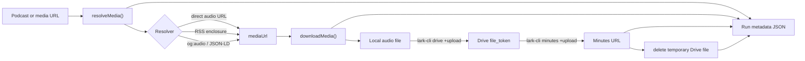

# pod-lark-minutes

<p align="center">
  <strong>English</strong> | <a href="./README.zh-CN.md">简体中文</a>
</p>

<p align="center">
  
</p>

`pod-lark-minutes` creates Feishu/Lark Minutes from podcast and media URLs.

It keeps the workflow intentionally small:

```text
podcast/media URL -> local audio -> temporary Feishu/Lark Drive file -> Feishu/Lark Minutes
```

Feishu/Lark Minutes handles transcription and smart summary after the upload. This CLI focuses on resolving the audio source, downloading it locally, using Feishu/Lark Drive as the required temporary upload layer, and creating the Minutes entry.

The current MVP does not fetch transcripts or smart summaries back to local files.

## Features

- Resolve Xiaoyuzhou episode pages through `og:audio`.
- Download direct audio URLs such as `.m4a`, `.mp3`, `.aac`, `.wav`, and `.ogg`.
- Resolve the first enclosure from basic RSS feeds.
- Upload local audio with `lark-cli drive +upload`.
- Create a Minutes link with `lark-cli minutes +upload`.
- Delete the temporary Drive audio file after a successful Minutes upload by default.
- Record each run as JSON metadata.

## Requirements

- Node.js 20+
- `lark-cli` available on `PATH`
- Feishu/Lark user auth for Drive upload and Minutes upload

Check the local prerequisites:

```bash
node --version
lark-cli --version
lark-cli drive +upload --help
lark-cli minutes +upload --help
```

`lark-cli` authentication and permission scopes are configured outside this project. If upload commands fail with an auth or scope error, fix the `lark-cli` setup first.

## Installation

Install the CLI from npm:

```bash
npm install -g pod-lark-minutes
pod-lark-minutes --help
```

Alternatively, install from GitHub:

```bash
npm install -g github:catwithtudou/pod-lark-minutes
pod-lark-minutes --help
```

Or run from a local checkout:

```bash
git clone https://github.com/catwithtudou/pod-lark-minutes.git
cd pod-lark-minutes
npm install
node bin/pod-lark-minutes.js --help
```

For local development, link the CLI name:

```bash
npm link
pod-lark-minutes --help
```

This project is a small Node.js CLI and does not currently need a compile or transpile step. Packaging is handled by npm through the `bin` entry in `package.json`; `npm pack` and `npm publish` produce an installable tarball.

## Optional Agent Skill

This repository also ships an agent skill at [`skills/pod-lark-minutes`](./skills/pod-lark-minutes/SKILL.md). It helps compatible coding agents install, verify, and run the CLI safely; it does not replace installing the Node.js CLI itself.

Install the skill from GitHub:

```bash
npx -y skills@latest add https://github.com/catwithtudou/pod-lark-minutes/tree/main/skills/pod-lark-minutes --skill pod-lark-minutes --global --yes
```

Or install it from a local checkout:

```bash
npx -y skills@latest add ./skills/pod-lark-minutes --skill pod-lark-minutes --global --yes
```

## Prepare lark-cli

`pod-lark-minutes` delegates Feishu/Lark operations to [`lark-cli`](https://github.com/larksuite/cli), the official open-source Lark/Feishu CLI. The npm package is [`@larksuite/cli`](https://www.npmjs.com/package/@larksuite/cli).

Install `lark-cli`:

```bash
npx @larksuite/cli@latest install
lark-cli --version
```

Initialize app credentials and log in as a user:

```bash
lark-cli config init
lark-cli auth login --domain drive,minutes
lark-cli auth status
```

Then verify the two commands used by this CLI:

```bash
lark-cli drive +upload --help
lark-cli minutes +upload --help
lark-cli doctor
```

If a command reports missing permissions, follow the `lark-cli` error hint and grant the missing scope. The full upload flow requires user access to Drive upload and Minutes upload.

## Usage

Create a Feishu/Lark Minutes link from a podcast episode:

```bash
pod-lark-minutes "https://www.xiaoyuzhoufm.com/episode/xxxx"
```

Download audio only, without uploading to Feishu/Lark:

```bash
pod-lark-minutes "https://www.xiaoyuzhoufm.com/episode/xxxx" --audio-only
```

Use a custom output directory:

```bash
pod-lark-minutes "https://www.xiaoyuzhoufm.com/episode/xxxx" --out-dir ./outputs
```

Remove the local audio file after a successful Minutes upload:

```bash
pod-lark-minutes "https://www.xiaoyuzhoufm.com/episode/xxxx" --cleanup
```

Keep the uploaded Drive audio file instead of deleting it after Minutes creation:

```bash
pod-lark-minutes "https://www.xiaoyuzhoufm.com/episode/xxxx" --keep-drive-file
```

Combine options:

```bash
pod-lark-minutes "https://www.xiaoyuzhoufm.com/episode/xxxx" --out-dir ./outputs --cleanup
```

## Options

| Option | Description |
| --- | --- |
| `--out-dir <dir>` | Output directory. Defaults to `./pod-lark-minutes-output`. |
| `--audio-only` | Resolve and download audio only; skip Drive and Minutes upload. |
| `--cleanup` | Delete the local audio file after a successful Minutes upload. |
| `--keep-drive-file` | Keep the uploaded Drive audio file. By default, it is deleted after Minutes creation succeeds. |
| `--help` | Show CLI usage. |

## Output And Metadata

```text
pod-lark-minutes-output/
  audio/
    <title>.m4a
  runs/
    <run-id>.json
```

The run JSON records the source URL, resolved media URL, local audio path, Drive upload result, Drive cleanup status, and `minute_url` when a Minutes upload is created.

Downloaded audio and run metadata can contain private podcast URLs, local paths, Drive upload responses, and Minutes links. Do not commit `pod-lark-minutes-output/`, logs, tokens, auth URLs, internal Feishu/Lark links, or generated audio files.

After a successful Minutes upload, the uploaded Drive audio file is deleted by default. Use `--keep-drive-file` only when you want to retain that Drive file.

`--cleanup` removes the local audio only after a successful Minutes upload. When using `--audio-only`, delete the downloaded audio manually if you do not need to keep it.

## Supported Inputs

| Input | Status |
| --- | --- |
| Xiaoyuzhou episode URL | Supported |
| Direct audio URL | Supported |
| RSS feed with `<enclosure>` | Basic support |
| Other podcast platforms | Works only when the page exposes `og:audio` or JSON-LD `contentUrl` |

## Feishu/Lark Upload Flow

The Feishu/Lark side is a two-step flow:

```text
local file -> lark-cli drive +upload -> file_token -> lark-cli minutes +upload -> minute_url
```

The web UI may hide this detail, but the CLI needs the Drive `file_token` before it can create a Minutes entry. The Drive file is treated as a temporary bridge and is deleted after Minutes creation succeeds unless `--keep-drive-file` is set.

## Technical Architecture



| Component | Responsibility |
| --- | --- |
| `parseArgs()` | Parse URL and CLI flags. |
| `resolveMedia()` | Convert supported pages, feeds, and direct audio URLs into a normalized media object. |
| `downloadMedia()` | Download audio into the output directory and infer file extension from content type or URL. |
| `uploadToDrive()` | Call `lark-cli drive +upload` and read the returned Drive `file_token`. |
| `createMinute()` | Call `lark-cli minutes +upload` with the Drive `file_token`. |
| `deleteDriveFile()` | Delete the temporary Drive audio file after Minutes creation succeeds. |
| `writeRunMetadata()` | Persist run metadata under `runs/<run-id>.json`. |

The CLI intentionally keeps platform logic in `lark-cli` and keeps podcast-source logic in this project. That keeps the MVP small: source resolution, local download, temporary Drive upload, Minutes creation, Drive cleanup, and metadata recording.

## Troubleshooting

| Symptom | What to check |
| --- | --- |
| `Could not resolve an audio URL from this input` | The page may not expose `og:audio`, JSON-LD `contentUrl`, or an RSS `<enclosure>`. |
| Download fails with a non-2xx status | The media URL may be expired, region-restricted, or blocked by the source platform. |
| `lark-cli` command is not found | Install `lark-cli` and make sure it is available on `PATH`. |
| Drive upload does not return `data.file_token` | Check `lark-cli` auth, user scope, and Drive upload permission. |
| Minutes upload fails | Check Minutes upload permission and whether the uploaded file type is supported by Feishu/Lark Minutes. |
| Drive cleanup fails after Minutes creation | The Minutes link is still recorded; delete the uploaded Drive file manually or rerun with `--keep-drive-file` if you want to retain it. |

## Development

```bash
npm install
npm run check
npm test
```

Before publishing a release, also check the CLI help and package contents:

```bash
node bin/pod-lark-minutes.js --help
npm pack --dry-run
```

To verify the package can be installed without a local checkout, pack and install into a temporary npm prefix:

```bash
npm pack --pack-destination /tmp
npm install --prefix /tmp/pod-lark-minutes-install-test -g /tmp/pod-lark-minutes-0.2.0.tgz
/tmp/pod-lark-minutes-install-test/bin/pod-lark-minutes --help
```

For parser changes, add network-free tests when possible. For upload behavior, verify with `--audio-only` first, then run the full flow only when `lark-cli` auth is available.

## License

MIT. See [LICENSE](LICENSE).
