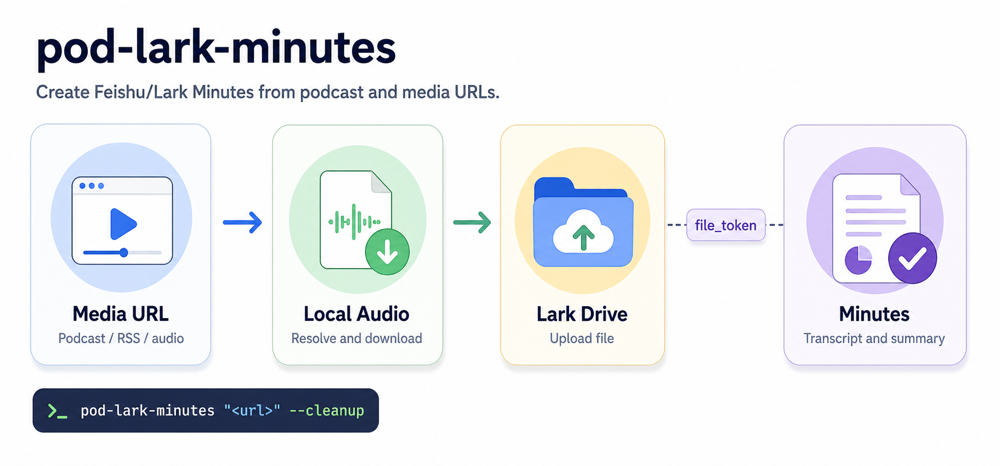
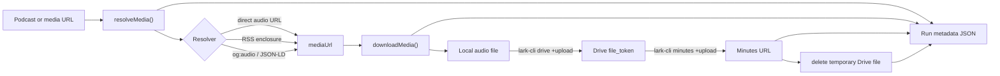

# pod-lark-minutes

<p align="center">
  <a href="./README.md">English</a> | <strong>简体中文</strong>
</p>

<p align="center">
  
</p>

`pod-lark-minutes` 用于把播客或媒体 URL 转成飞书/Lark 妙记链接

它刻意保持一条很小的工作流：

```text
podcast/media URL -> local audio -> temporary Feishu/Lark Drive file -> Feishu/Lark Minutes
```

上传完成后，转写和智能摘要由飞书/Lark 妙记生成。这个 CLI 只负责解析音频来源、下载到本地、把飞书/Lark 云空间作为必需的临时上传层，并创建妙记

当前 MVP 不会把妙记里的转写稿或智能摘要再拉回本地文件

## 功能

- 通过 `og:audio` 解析小宇宙单集页
- 下载 `.m4a`、`.mp3`、`.aac`、`.wav`、`.ogg` 等直链音频
- 从基础 RSS feed 中解析第一个 `<enclosure>`
- 通过 `lark-cli drive +upload` 上传本地音频
- 通过 `lark-cli minutes +upload` 创建妙记链接
- 妙记创建成功后默认删除临时上传到云空间的音频文件
- 将每次运行记录为 JSON metadata

## 前置要求

- Node.js 20+
- `lark-cli` 已安装并在 `PATH` 中可用
- 已完成飞书/Lark 用户授权，具备云空间上传和妙记上传权限

检查本地环境：

```bash
node --version
lark-cli --version
lark-cli drive +upload --help
lark-cli minutes +upload --help
```

`lark-cli` 的应用配置、登录和权限授权在本项目之外完成。如果上传命令返回认证或权限错误，需要先修复 `lark-cli` 配置

## 安装

从 npm 安装 CLI：

```bash
npm install -g pod-lark-minutes
pod-lark-minutes --help
```

也可以从 GitHub 安装：

```bash
npm install -g github:catwithtudou/pod-lark-minutes
pod-lark-minutes --help
```

从本地 checkout 运行：

```bash
git clone https://github.com/catwithtudou/pod-lark-minutes.git
cd pod-lark-minutes
npm install
node bin/pod-lark-minutes.js --help
```

本地开发时可以 link CLI 名称：

```bash
npm link
pod-lark-minutes --help
```

这个项目是一个小型 Node.js CLI，目前不需要编译或转译步骤。npm 会通过 `package.json` 里的 `bin` 入口打包可安装的命令，`npm pack` 和 `npm publish` 会产出可安装的 tarball

## 可选 Agent Skill

这个仓库也提供了一个 agent skill，位置是 [`skills/pod-lark-minutes`](./skills/pod-lark-minutes/SKILL.md)。它用于帮助兼容的编码 agent 安装、验证和运行 CLI；它不替代 Node.js CLI 本身的安装。

从 GitHub 安装 skill：

```bash
npx -y skills@latest add https://github.com/catwithtudou/pod-lark-minutes/tree/main/skills/pod-lark-minutes --skill pod-lark-minutes --global --yes
```

也可以从本地 checkout 安装：

```bash
npx -y skills@latest add ./skills/pod-lark-minutes --skill pod-lark-minutes --global --yes
```

## 准备 lark-cli

`pod-lark-minutes` 将飞书/Lark 侧操作委托给 [`lark-cli`](https://github.com/larksuite/cli)。它是 Lark/Feishu 官方开源 CLI，对应 npm 包是 [`@larksuite/cli`](https://www.npmjs.com/package/@larksuite/cli)

安装 `lark-cli`：

```bash
npx @larksuite/cli@latest install
lark-cli --version
```

初始化应用配置，并以用户身份登录：

```bash
lark-cli config init
lark-cli auth login --domain drive,minutes
lark-cli auth status
```

确认本工具依赖的两个命令可用：

```bash
lark-cli drive +upload --help
lark-cli minutes +upload --help
lark-cli doctor
```

如果命令提示缺少权限，按 `lark-cli` 的错误提示补充授权。完整上传链路需要用户身份具备云空间上传和妙记上传权限

## 使用

从播客单集创建飞书/Lark 妙记链接：

```bash
pod-lark-minutes "https://www.xiaoyuzhoufm.com/episode/xxxx"
```

只下载音频，不上传到飞书/Lark：

```bash
pod-lark-minutes "https://www.xiaoyuzhoufm.com/episode/xxxx" --audio-only
```

指定输出目录：

```bash
pod-lark-minutes "https://www.xiaoyuzhoufm.com/episode/xxxx" --out-dir ./outputs
```

妙记创建成功后删除本地音频：

```bash
pod-lark-minutes "https://www.xiaoyuzhoufm.com/episode/xxxx" --cleanup
```

妙记创建成功后保留云空间里的上传音频：

```bash
pod-lark-minutes "https://www.xiaoyuzhoufm.com/episode/xxxx" --keep-drive-file
```

组合使用参数：

```bash
pod-lark-minutes "https://www.xiaoyuzhoufm.com/episode/xxxx" --out-dir ./outputs --cleanup
```

## 参数

| 参数 | 说明 |
| --- | --- |
| `--out-dir <dir>` | 输出目录，默认是 `./pod-lark-minutes-output` |
| `--audio-only` | 只解析并下载音频，跳过云空间和妙记上传 |
| `--cleanup` | 妙记上传成功后删除本地音频文件 |
| `--keep-drive-file` | 保留上传到云空间的音频文件。默认会在妙记创建成功后删除该临时文件 |
| `--help` | 显示 CLI 帮助 |

## 输出和 metadata

```text
pod-lark-minutes-output/
  audio/
    <title>.m4a
  runs/
    <run-id>.json
```

运行 JSON 会记录 source URL、解析出的 media URL、本地音频路径、云空间上传结果、云空间清理状态，以及创建成功后的 `minute_url`

下载音频和运行 metadata 可能包含私有播客链接、本地路径、云空间上传响应和妙记链接。不要提交 `pod-lark-minutes-output/`、日志、token、auth URL、内部飞书/Lark 链接或生成的音频文件

妙记上传成功后，上传到云空间的音频文件默认会被删除。只有需要保留云空间原文件时，才使用 `--keep-drive-file`。

`--cleanup` 只会在妙记上传成功后删除本地音频。使用 `--audio-only` 时，如果不需要保留音频，需要手动删除下载结果

## 支持的输入

| 输入 | 状态 |
| --- | --- |
| 小宇宙单集 URL | 已支持 |
| 直链音频 URL | 已支持 |
| 带 `<enclosure>` 的 RSS feed | 基础支持 |
| 其他播客平台页面 | 仅在页面暴露 `og:audio` 或 JSON-LD `contentUrl` 时可用 |

## 飞书/Lark 上传链路

飞书/Lark 侧是两步上传流程：

```text
local file -> lark-cli drive +upload -> file_token -> lark-cli minutes +upload -> minute_url
```

Web UI 可能隐藏了这个细节，但 CLI 需要先拿到云空间 `file_token`，再创建妙记。云空间文件会被视为临时中转文件，妙记创建成功后默认删除，除非设置 `--keep-drive-file`

## 技术架构



| 组件 | 职责 |
| --- | --- |
| `parseArgs()` | 解析 URL 和 CLI 参数 |
| `resolveMedia()` | 将受支持的页面、feed 和直链音频转换成统一 media 对象 |
| `downloadMedia()` | 将音频下载到输出目录，并根据 content type 或 URL 推断扩展名 |
| `uploadToDrive()` | 调用 `lark-cli drive +upload`，读取返回的云空间 `file_token` |
| `createMinute()` | 使用云空间 `file_token` 调用 `lark-cli minutes +upload` |
| `deleteDriveFile()` | 妙记创建成功后删除临时上传到云空间的音频文件 |
| `writeRunMetadata()` | 将运行 metadata 写入 `runs/<run-id>.json` |

这个 CLI 将平台侧能力交给 `lark-cli`，将播客来源解析留在本项目内。这样 MVP 可以保持很小：来源解析、本地下载、临时云空间上传、妙记创建、云空间清理和 metadata 记录

## 排障

| 现象 | 检查点 |
| --- | --- |
| `Could not resolve an audio URL from this input` | 页面可能没有暴露 `og:audio`、JSON-LD `contentUrl` 或 RSS `<enclosure>` |
| 下载返回非 2xx 状态 | 媒体 URL 可能已过期、受地域限制，或被来源平台拦截 |
| 找不到 `lark-cli` 命令 | 安装 `lark-cli`，并确认它在 `PATH` 中 |
| 云空间上传没有返回 `data.file_token` | 检查 `lark-cli` 登录状态、用户授权 scope 和云空间上传权限 |
| 妙记上传失败 | 检查妙记上传权限，以及飞书/Lark 妙记是否支持该文件类型 |
| 妙记创建后云空间清理失败 | 妙记链接仍会写入 metadata；可以手动删除该云空间文件，或在需要保留时使用 `--keep-drive-file` |

## 开发

```bash
npm install
npm run check
npm test
```

发布版本前，也需要检查 CLI help 和 npm 包内容：

```bash
node bin/pod-lark-minutes.js --help
npm pack --dry-run
```

验证 package 不依赖本地 checkout 也能安装：

```bash
npm pack --pack-destination /tmp
npm install --prefix /tmp/pod-lark-minutes-install-test -g /tmp/pod-lark-minutes-0.2.0.tgz
/tmp/pod-lark-minutes-install-test/bin/pod-lark-minutes --help
```

改来源解析逻辑时，优先补网络无关的单元测试。改上传链路时，先用 `--audio-only` 验证解析和下载；只有在 `lark-cli` 授权可用时，再验证完整上传流程

## License

MIT. See [LICENSE](LICENSE)
